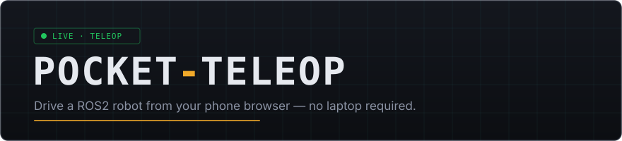
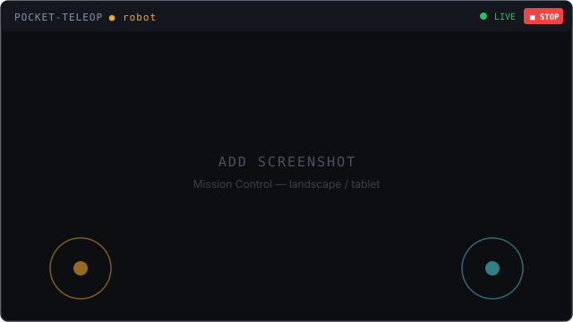
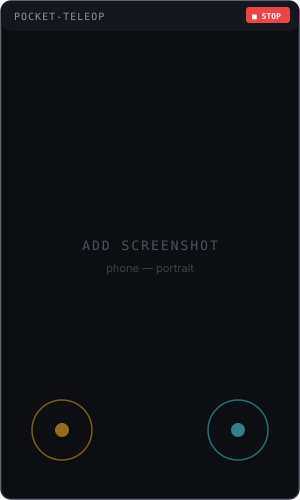
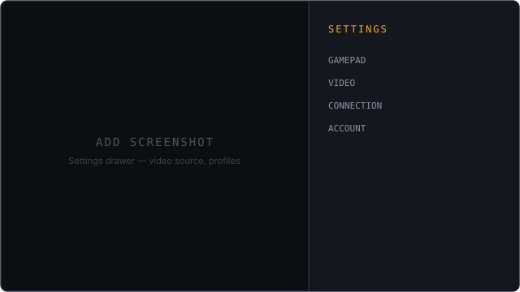
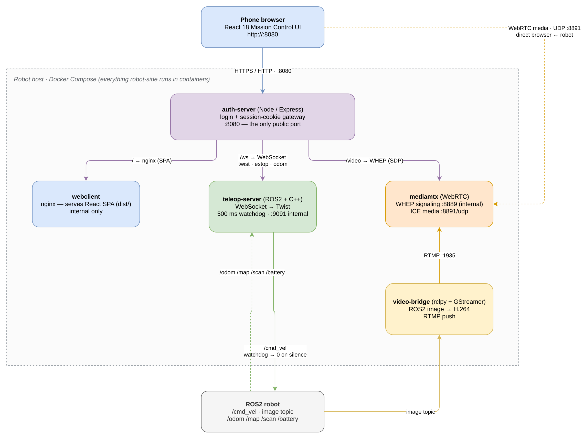
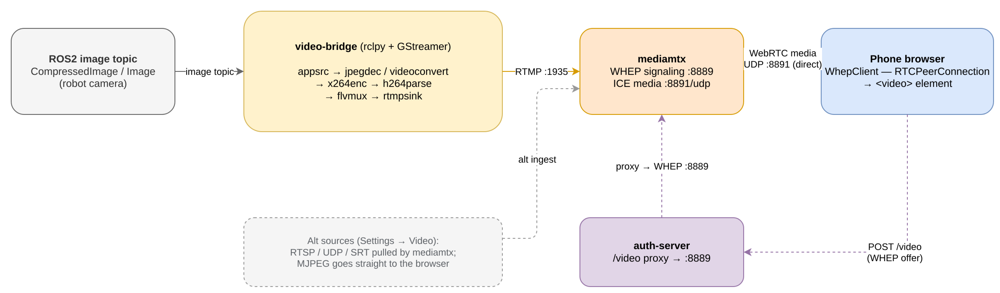

<p align="center">
  
</p>

<p align="center">
  <em>Control a ROS2 robot from your phone browser — no laptop, no app install.</em>
</p>

<p align="center">
  
  
  
  
</p>

---

**pocket-teleop** bridges a phone browser to a ROS2 robot. A login-gated WebSocket carries velocity commands to `/cmd_vel`, WebRTC carries video back, and a 500 ms server watchdog publishes a zero velocity if the command link goes silent. Everything robot-side runs in Docker — the host only needs Docker and Docker Compose.

## Highlights

- **Phone-first Mission Control UI** — touch joysticks, live telemetry, and a heads-up video feed that adapt across phone (portrait/landscape) and tablet/foldable layouts.
- **Multiple input sources** — gamepad (USB/Bluetooth), on-screen touch joysticks, and keyboard. Inputs are arbitrated so a single source owns control at a time (gamepad > keyboard > touch), with deadzone + response-curve shaping and acceleration limiting for smooth, jerk-free motion.
- **Adjustable speed limits** — per-axis linear/angular caps, set live from the UI and persisted.
- **Latching E-STOP** — from the on-screen button, the spacebar, or the gamepad left bumper; one shared latch across every source.
- **Low-latency video** — WebRTC via MediaMTX (~100–300 ms on a LAN), with runtime-switchable sources (ROS2 topic, RTSP, UDP/SRT, MJPEG).
- **Robot-localized minimap** — SLAM occupancy grid (transient_local `/map`), tf2 `map→base_link` pose, and lidar overlay in a robot-centered rotating view with pinch-to-zoom; falls back to odometry when SLAM is unavailable.
- **Access control** — session-cookie login, single operator, forced password change on first run, session-authenticated WebSocket upgrade, failed-login rate limiting (10/min per IP, 5/min per username → 429 + Retry-After), 30-minute idle timeout (warning banner with a "Stay logged in" button; real operator input counts as activity, an expired session also closes the control WebSocket). Plain HTTP by default for trusted LANs; opt-in HTTPS via `--profile tls` (see [Enabling HTTPS](#enabling-https-tls)).

## Screenshots

> Placeholders below — drop real captures into [`docs/screenshots/`](docs/screenshots) and update the paths.

<p align="center">
  
  &nbsp;
  
</p>
<p align="center">
  
</p>

## Architecture

Everything robot-side runs in Docker. The browser reaches the stack through a single public port (8080) fronted by auth-server; only the WebRTC media flows direct over UDP 8891.

<p align="center">
  
</p>

- **auth-server** is the only public entrypoint — it authenticates the session, then proxies `/` to the webclient nginx, `/ws` to the C++ teleop-server, and `/video` (WHEP SDP) to MediaMTX.
- **teleop-server** turns WebSocket twist/E-STOP messages into `/cmd_vel`, with a 500 ms watchdog that publishes zero velocity if the command link goes silent, and relays `/odom` `/map` `/scan` `/battery` back for the minimap.
- **video-bridge** encodes a ROS2 image topic to H.264 and pushes it over RTMP to MediaMTX; the browser pulls it back over WebRTC, with media travelling direct (UDP 8891) while only the SDP signaling passes through auth-server.

## Quick start

```bash
# 1. Create your .env from the template
cp .env.example .env
```

Fill in the three required values:

```bash
TELEOP_ADMIN_USER=operator       # login username
TELEOP_ADMIN_PASSWORD=changeme   # initial password (you'll change it on first login)
SESSION_SECRET=<random hex>      # generate with: openssl rand -hex 32
```

```bash
# 2. Build and start the stack
docker compose up --build

# 3. Open the UI on your phone
#    http://<robot-ip>:8080
```

On first login you're prompted to change the password. New credentials persist in the `auth-data` Docker volume across reboots and rebuilds.

> **Find the robot's IP:** run `hostname -I` on the robot and use the first address.

## Managing the stack

```bash
docker compose up --build -d         # start in the background
docker compose logs -f               # follow logs
docker compose down                  # stop (keeps credentials)
docker compose down && docker compose up --build   # restart after a code pull
docker compose down -v               # reset everything, incl. credentials
```

## Enabling HTTPS (TLS)

By default the stack serves plain HTTP on port 8080 — fine for a trusted LAN,
not for anything routable. An opt-in Caddy frontend terminates TLS on 443/80
and proxies everything (UI, WebSocket, video signaling) to auth-server:

```bash
# .env: set TLS_DOMAIN, optionally TLS_ACME_EMAIL, and BIND_HOST=127.0.0.1
docker compose -p pocket-teleop --env-file ./.env --profile tls up --build -d
```

| Mode | .env | Notes |
|---|---|---|
| Plain HTTP (default) | no `--profile tls` | Unchanged behavior; LAN-only deployments |
| Self-signed | `TLS_DOMAIN=<LAN IP or hostname>`, `TLS_ACME_EMAIL` empty | Caddy's internal CA signs the cert; each phone must trust the root CA once (below) |
| Let's Encrypt | `TLS_DOMAIN=<public domain>`, `TLS_ACME_EMAIL=<you@example.com>` | Domain must resolve publicly and ports 80/443 must be reachable from the internet |

With TLS enabled, also set `BIND_HOST=127.0.0.1` in `.env` so auth-server's
plain-HTTP port 8080 is reachable only via Caddy, and allow 443 through the
firewall (`sudo ufw allow 443/tcp`). The session cookie picks up the `Secure`
flag automatically on HTTPS requests. WebRTC video is already DTLS-encrypted
in both modes; only signaling moves under TLS.

**Trusting the self-signed root CA on a phone** — export it from the Caddy
container:

```bash
docker compose -p pocket-teleop cp caddy:/data/caddy/pki/authorities/local/root.crt .
```

Then install `root.crt` on the device: **iOS** — AirDrop/download the file,
install the profile (Settings → General → VPN & Device Management), then
enable it under Settings → General → About → Certificate Trust Settings.
**Android** — Settings → Security → More security settings → Install from
device storage → CA certificate. Until the CA is trusted, the browser blocks
the WebSocket upgrade, so the UI loads but nothing connects.

## Controls

| Source | Drive | Notes |
|---|---|---|
| **Gamepad** | left stick = forward/back + rotate, right stick = strafe | E-STOP on the left bumper (LB). Deadzone + response curve applied. |
| **Touch joysticks** | left zone = drive, right zone = strafe | Bottom-corner hold-zones; the knob mirrors gamepad input when a pad is active. |
| **Keyboard** | WASD = drive (W/S forward/back, A/D rotate), ← / → = strafe | Each key drives at the full configured speed; keys are ignored while you're typing in a text field. Spacebar = E-STOP. |

- **Input priority:** if several inputs are active at once, one owns control — gamepad beats keyboard beats touch. A higher-priority source sitting idle (say, a connected pad with its stick centred) won't block a lower one.
- **Smooth motion:** the robot ramps up to speed (~0.5 s) and slows to a stop (~0.2 s) instead of lurching. **E-STOP skips the ramp and stops immediately.**
- **Speed limits:** set the max linear (m/s) and angular (rad/s) caps live from the left rail's **SPEED** panel; the value is shaped, scaled, and shown as the published `cmd_vel`.
- **E-STOP:** latches across all sources — engage from any one, reset from any one.

## Robot configuration

All optional; set in `.env` before starting:

| Variable | Default | Description |
|---|---|---|
| `ROBOT_TYPE` | `diff_drive` | `diff_drive` or `holonomic` |
| `ROBOT_NAME` | _(none)_ | Display name shown in the UI |
| `ROBOT_NAMESPACE` | _(none)_ | ROS2 namespace prefix for topics |
| `ROBOT_LENGTH_M` | _(none)_ | Footprint length in metres (bumper-to-bumper). Draws a to-scale outline on the minimap. _TurtleBot3 Waffle: `0.281`_ |
| `ROBOT_WIDTH_M` | _(none)_ | Footprint width in metres (wheel-to-wheel). _TurtleBot3 Waffle: `0.306`_ |
| `TELEOP_SERVER_URL` | _auto-detected_ | auth-server finds the Docker bridge gateway at startup; override only if that detection is wrong |

Set both `ROBOT_LENGTH_M` and `ROBOT_WIDTH_M` to overlay a dashed outline of the robot's body on the minimap, drawn to scale and oriented with the heading — useful for judging clearances near obstacles. Leave either unset to keep the plain centre arrow. The outline auto-hides when zoomed too far out to be legible.

The web client also registers a service worker that precaches the app shell (HTML/JS/CSS/fonts), so a returning operator opens straight to the cached UI and a weak Wi-Fi link still reaches the login screen. The live control stream (WebSocket, WHEP signalling, WebRTC video) never passes through the cache. If a UI update doesn't appear after a redeploy, hard-reload once (see TROUBLESHOOTING.md).

### Supported robots

| Drive type | Axes used |
|---|---|
| Differential drive | `linear_x`, `angular_z` |
| Holonomic / omnidirectional | `linear_x`, `linear_y`, `angular_z` |

### Robot localization (SLAM + odometry)

Minimap rendering requires odometry; SLAM is optional:

| Variable | Default | Description |
|---|---|---|
| `ODOM_TOPIC` | `/odom` | Odometry source; always used as fallback |
| `MAP_TOPIC` | `/map` | SLAM occupancy grid topic |
| `SCAN_TOPIC` | `/scan` | 2D lidar scan for the obstacle overlay |
| `BATTERY_TOPIC` | `/battery_state` | `sensor_msgs/BatteryState`; shows a BAT % readout (green/amber/red + ⚡ charging). No such topic = no badge |
| `MAP_FRAME` | `map` | Frame ID for SLAM origin |
| `ODOM_FRAME` | `odom` | Frame ID for odometry origin |
| `BASE_FRAME` | `base_link` | Robot base frame for pose/scan transforms |
| `MAP_WINDOW_M` | `24.0` | Side length of the transmitted map crop window, centered on the robot (24.0 → 24×24 m) |

When SLAM publishes the map and the `map→base_link` transform, the UI shows the SLAM-localized pose (with lidar overlay when a scan is available). If SLAM is unavailable or silent, the minimap falls back to odometry (`odom→base_link`).

### Disconnect behavior (safety)

What the robot does when the operator's connection drops and the watchdog fires. The active mode is shown read-only in **Settings → Robot**.

| Variable | Default | Description |
|---|---|---|
| `DISCONNECT_ACTION` | `stop` | `stop` \| `hold` \| `continue` \| `return_home` |
| `DISCONNECT_ACTION_PARAM` | `0` | For `hold`/`continue`: ms to keep republishing the last command before stopping |
| `RETURN_HOME_SERVICE` | `/return_home` | `std_srvs/Trigger` service called once for `return_home` |

- **`stop`** (default) — publish zero velocity and close. Fail-stop; backward compatible.
- **`hold`** / **`continue`** — keep republishing the last command for `DISCONNECT_ACTION_PARAM` ms, then stop. **⚠ Violates fail-stop — a lost link keeps the robot moving. Use only where an abrupt stop is itself unsafe.**
- **`return_home`** — **auto-trigger is currently disabled**; on disconnect it logs and behaves as `stop`. The `RETURN_HOME_SERVICE` client is wired and ready to re-enable (one-line change in `teleop_node.cpp`).

Set in `.env`; takes effect on the next `docker compose ... up -d`.

## Video streaming

The video panel auto-connects over WebRTC (via MediaMTX) and can be re-sourced at runtime from **Settings → Video** — no restart needed.

<p align="center">
  
</p>

**One-time firewall rule** (WebRTC media is direct phone ↔ robot over UDP):

```bash
sudo ufw allow 8891/udp
```

| Source | How |
|---|---|
| **ROS2 topic** (default) | Set `VIDEO_TOPIC` + `VIDEO_TOPIC_TYPE` (`compressed` or `raw`) in `.env`. Find it with `ros2 topic list \| grep -i image`. |
| **RTSP camera** | Settings → Video → **RTSP URL** → Apply. MediaMTX pulls it directly. |
| **UDP / SRT** | Settings → Video → **UDP/SRT stream** → e.g. `udp://192.168.1.200:1234`, `srt://192.168.1.200:8890`. |
| **MJPEG** | Settings → Video → **MJPEG URL** → the browser connects directly to the camera. |
| **Disabled** | Settings → Video → **Disabled** → no stream consumed. |

Common ROS2 topics: TurtleBot3 (Pi Camera) `/raspicam_node/image/compressed`, TurtleBot4 (OAK-D) `/oakd/rgb/preview/image_raw/compressed`.

## Running tests

All suites run inside Docker — no local Node.js or Python needed.

```bash
docker compose --profile test run --rm webclient-test       # web client (React + Vitest)
docker compose --profile test run --rm auth-server-test     # auth server
docker compose --profile test run --rm video-bridge-test    # video-bridge (pytest)
```

C++ server tests build and run via the server image; see [repository-structure.md](memory/agent-guides/repository-structure.md).

## Troubleshooting

Common problems (video not appearing, gamepad not detected in Brave, held-stick drop-outs, slow first load, ROS2 discovery) are covered in **[TROUBLESHOOTING.md](TROUBLESHOOTING.md)**.

## Documentation

| Document | Description |
|---|---|
| [`TROUBLESHOOTING.md`](TROUBLESHOOTING.md) | Common problems and fixes |
| [`AGENTS.md`](AGENTS.md) | Architecture, dev workflow, agent handoff state |
| [`memory/agent-guides/repository-structure.md`](memory/agent-guides/repository-structure.md) | File map, build commands, port assignments |
| [`memory/agent-guides/techstack.md`](memory/agent-guides/techstack.md) | Language, runtime, and dependency details |
| [`memory/agent-guides/data-schema.md`](memory/agent-guides/data-schema.md) | Message protocol, ROS2 parameters, env vars |
