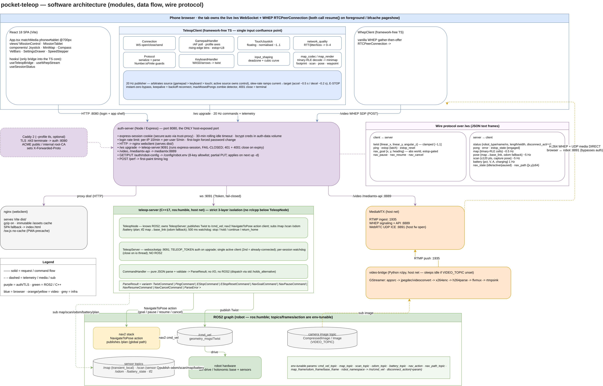

# pocket-teleop — architecture (software level)

This is the deep companion to the system overview in the [README](../README.md#architecture).
It drills past the container boxes into the modules inside each service, the data that
flows between them, and the wire protocol on the `/ws` link.

<p align="center">
  
</p>

> Source: [`assets/architecture-detailed.drawio`](assets/architecture-detailed.drawio)
> (editable — the `.drawio.png` and `.svg` exports embed the same XML).

---

## The shape of the system

A phone browser drives a ROS2 robot. Everything robot-side runs in Docker; the browser
reaches it through a **single host-exposed port, 8080**, fronted by `auth-server`. The only
traffic that does *not* go through 8080 is WebRTC video media, which flows direct over
UDP 8891 — only its SDP signaling passes through the proxy.

Three independent data paths share that one entrypoint:

| Path | Browser module | Proxy route | Backend |
|---|---|---|---|
| App shell | React SPA | `HTTP /` | nginx (serves `dist/`) |
| Control + telemetry | `TeleopClient` | `/ws` upgrade | `teleop-server:9091` |
| Video | `WhepClient` | `/video` (SDP only) | MediaMTX (media direct UDP 8891) |

---

## Browser — the tab is the client

There is no application server holding state; the browser tab owns the live `/ws`
WebSocket and the WHEP `RTCPeerConnection`. A backgrounded tab gets its timers throttled,
so both `useTeleopBridge` and `useWhepStream` listen for `visibilitychange`→visible and
bfcache `pageshow`, then call the client's `resume()` to recover fast instead of waiting
out backoff.

React only touches the transport layer through `hooks/`. Everything below is
**framework-free TypeScript** — no React imports — so it is unit-testable in isolation.

### `TeleopClient` — the single input confluence point

All three input sources call one method, `sendTwist(lx, ly, az, source)`. There is exactly
one arbitration site:

- **Priority** gamepad (3) > keyboard (2) > touch (1), but this is *not* strict static
  priority. The **active source owns control**; priority only breaks simultaneity. A source
  is active if it sent accepted input within `ACTIVE_WINDOW_MS` (400 ms). A non-zero input
  acquires when the owner is idle, continues when it is the same source, seizes when its
  priority ≥ the owner, else is rejected. A zero (release) is honored only from the owner —
  so a centered gamepad stick (which zeroes every frame) never locks out touch.
- **The 20 Hz publisher owns the send.** `sendTwist` only sets a target; the publisher
  slew-rate-limits `currentTwist` → `targetTwist` one bounded step per tick (accel ~0.5 s
  to full, decel ~0.2 s — sharper so stops stay prompt), so a large command never jerks the
  robot. It emits exactly one terminal zero at rest, then goes silent. **E-STOP bypasses the
  limiter** — it forces current and target to zero instantly.
- **Resilience:** keepalive pings, backoff reconnect, a `maxMissedPongs` zombie detector,
  and a `4001` close treated as terminal (idle-timeout kill → redirect to login).

Submodules: `Connection` (WS lifecycle), `Protocol` (serialize + parse with
`Number.isFinite` guards on every inbound numeric field), `GamepadHandler` (+ `GamepadProfiles`),
`KeyboardHandler`, `TouchJoystick`, `input_shaping` (deadzone + cubic), `network_quality`
(RTT/jitter/loss → 0–4), and `map_codec`/`map_render` (trinary-RLE decode → minimap raster
with footprint, scan, pose, and waypoint overlays).

### `WhepClient` — video

Vanilla WHEP (gather-then-offer): POST the SDP offer to `/video/teleop/whep`, attach the
answer, render the track to a `<video>`. It polls `getStats` at 1 Hz, retries with backoff,
and runs an fps-stall watchdog — if `framesDecoded` is flat for 3 polls it rebuilds the peer
connection. `resume()` rebuilds the PC on foreground.

---

## auth-server — the gateway

Node/Express on 8080, the only host-exposed port. It is a session gate *and* a reverse proxy.

- **Sessions:** `express-session` cookie (bcrypt-hashed creds in the `auth-data` volume),
  30-minute rolling idle timeout, first-login forced password change. Single-operator model.
- **Rate limiting:** per-IP 10/min + per-user 5/min on login.
- **Proxying:**
  - `HTTP /` → nginx webclient.
  - `/ws` upgrade → `teleop-server:9091`, **fail-closed** — the upgrade handler runs
    express-session and rejects any request without a valid session; an expired session gets
    a 401, and a per-connection re-check every 60 s kills a stale socket with a `4001` close.
  - `/video`, `/mediamtx-api` → MediaMTX `:8889`.
  - `GET/PUT /auth/robot-config` → `/config/robot.env`, an **8-key allowlist** edited from the
    web Settings drawer (partial PUT, merged server-side; applies on next `up -d`).
  - `POST /perf` → first-paint timing log.

Behind the optional `--profile tls` Caddy frontend, the cookie's `secure` flag follows
`X-Forwarded-Proto`; plain-HTTP LAN keeps a non-Secure cookie and works unchanged.

---

## teleop-server — C++ ROS2 node, three strict layers

C++17 on `ros:humble`. The defining rule is **layer isolation: no `rclcpp` below `TeleopNode`**,
so the lower layers compile and unit-test without a ROS2 runtime.

| Layer | Knows | Responsibility |
|---|---|---|
| `TeleopNode` | ROS2 | Owns the server; publishes `Twist` to `/cmd_vel`; nav2 `NavigateToPose` action client; subscribes `/map` `/scan` `/odom` `/battery` `/plan`; tf2 `map→base_link` (odom fallback); 500 ms watchdog. |
| `TeleopServer` | WebSocket | `websocketpp` on `:9091`; `TELEOP_TOKEN` auth on upgrade; single active client (a second gets `already-connected`); per-session watchdog (the close must run on the io thread). **No ROS2.** |
| `CommandHandler` | nothing | Pure JSON parse + validate → `ParseResult`. No I/O, no ROS2. |

```
ParseResult = variant< TwistCommand | PingCommand | EStopCommand | EStopResetCommand
                     | NavGoalCommand | NavPauseCommand | NavResumeCommand
                     | NavCancelCommand | ParseError >
```

Dispatch is `std::holds_alternative<>`. The watchdog fires once per session; its behavior is
configurable: `stop` (default, fail-stop), `hold`/`continue` (republish the last twist for a
window — these deliberately violate fail-stop), or `return_home` (auto-trigger currently
disabled by operator decision). E-STOP latches: one zero `cmd_vel`, cancel + clear any nav
goal, then ignore `twist` until `estop_reset`.

---

## Wire protocol over `/ws` (JSON text frames)

**client → server**

| Message | Fields | Notes |
|---|---|---|
| `twist` | `linear_x, linear_y, angular_z` | clamped `[-1, 1]`; out-of-range = `ParseError`, not clamp. `linear_y` always present (`0.0` for diff-drive). |
| `ping` | — | keepalive. |
| `estop` / `estop_reset` | — | latch / clear. |
| `nav_goal` | `x, y, heading` | absolute world pose; frame stamped server-side; estop-gated. |
| `nav_pause` / `nav_resume` / `nav_cancel` | — | resume is estop-gated; pause/cancel always honored. |

**server → client**

| Message | Payload | Rate |
|---|---|---|
| `status` | `robot_type/name/namespace`, `length/width`, `disconnect_action` | on connect / change |
| `pong` / `error` / `estop_state` | — / `message` / `engaged` | event |
| `map` | trinary-RLE occupancy cells (`u`/`f`/`o` + run length) | ~0.5 Hz |
| `pose` | `map→base_link` (odom fallback), `x/y/heading` | ~5 Hz |
| `scan` | ≤120 pts (0 = invalid), optional capture pose | ~5 Hz |
| `battery` | `percentage, voltage, current, charging` | 1 Hz |
| `nav_state` | `idle` / `active` / `paused` | on change |
| `nav_path` | decimated nav2 global plan, ≤64 `[x,y]` map-frame points | on change |

The inbound parser guards every numeric field with `Number.isFinite` — non-finite telemetry
must never reach render.

---

## Video pipeline

`video-bridge` (Python `rclpy`, host network) subscribes to the configured image topic and
feeds a GStreamer pipeline:

```
appsrc → jpegdec/videoconvert → x264enc → h264parse → flvmux → rtmpsink
```

It pushes RTMP to MediaMTX (`:1935`), which serves WHEP on `:8889`. The browser's `WhepClient`
POSTs its SDP through `auth-server` `/video`, but the **media itself flows direct over WebRTC
UDP `:8891`** — which is why that port must be opened on the host firewall
(`ufw allow … to any port 8891 proto udp`) or ICE fails. If `VIDEO_TOPIC` is unset the node
sleeps. (See also the dedicated [video pipeline diagram](assets/video-pipeline.png).)

---

## ROS2 graph — env-tunable

The node binds to topics/frames/action by parameter, so it drops onto an existing robot
without code changes:

`cmd_vel_topic` · `map_topic` · `scan_topic` · `odom_topic` · `battery_topic` ·
`nav_action` · `nav_path_topic` · `map_frame`/`odom_frame`/`base_frame` ·
`robot_namespace` (→ `/<ns>/cmd_vel`) · `disconnect_action` (+ param).

UI-tunable keys live in `config/robot.env` and are edited from the web Settings drawer; the
rest are `.env`-level. Full parameter/env tables live in
[`memory/agent-guides/data-schema.md`](../memory/agent-guides/data-schema.md).
